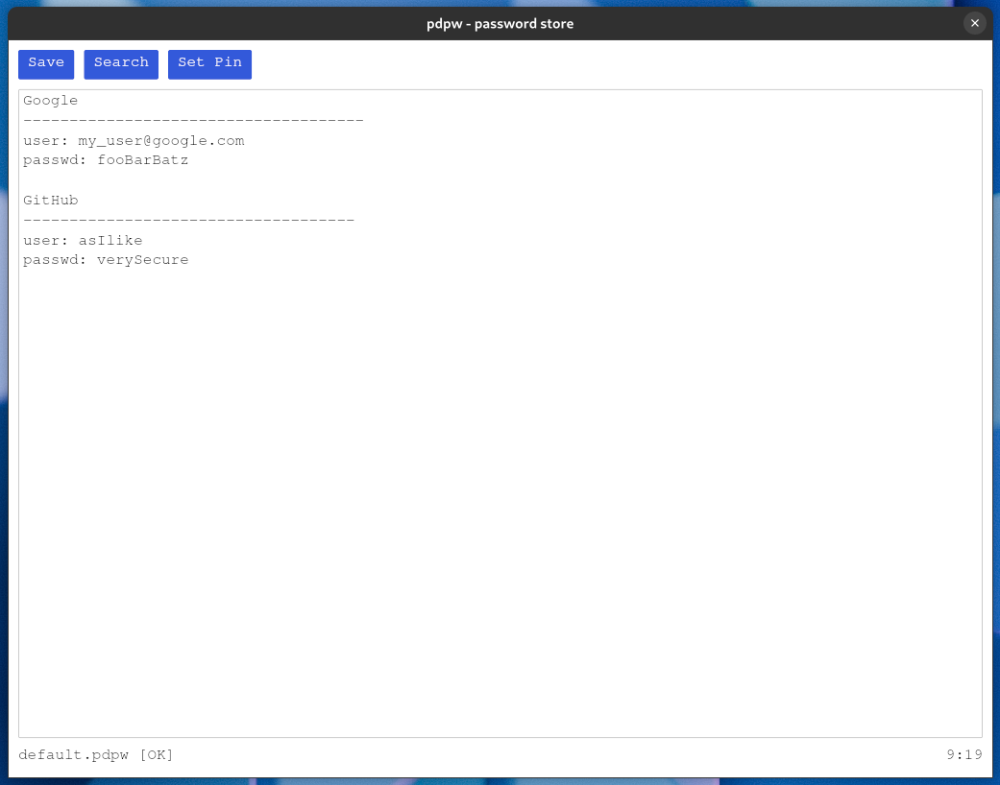

# pdpw

A very simple password store, that basically reads and writes an encrypted
textfile containing whatever you did put there 🤷‍♂️.

⚠️ Disclaimer: This software is still `WIP`. Pdpw depends on the
[age crate](https://github.com/str4d/rage), which is in `beta` currently!.



📢 Note: pdpw implements a forwarding Global Allocator to write a free pattern,
after memory got released. That way passwords no do not remain as clear text in
main memory. Also as soon as you close pdpw it will cleanup your clipboard in 
order to prevent leakage of passwords. In case you do not copy and paste your
passwords and just look them up and type them manually you can opt out of the
cleanup step using the `--skip-clipboard-cleanup` command line flag. 

## How to to install

```shell
cargo install --path .
```

Clearly the above only works if the Rust compiler is installed as described
[here](https://www.rust-lang.org/tools/install)


## First steps

If you start pdpw without providing a *.pdpw file it will create a
`default.pdpw` in your HOME directory.


## Shortcuts

- `strg + s` encrypt and save changes to the *.pdpw file that you have opened.
  Typically `default.pdpw`
- `strg + f` open the search dialog


## Configure Gnome Desktop integration

Add following line to `/etc/mime.types`

```text
application/pdpw                                pdpw
```

Now create a `pdpw.desktop` file in either `~/.local/share/applications` or
`/usr/share/applications` in case you want to configure `pdpw` for all users.

The desktop file should contain similar contents

```text
[Desktop Entry]
Type=Application
Name=PD Password
Comment=Encrypted File as Password Manager
Icon=/usr/share/icons/breeze/mimetypes/16/application-pgp-keys.svg
Exec=pdpw %F
Terminal=true
Categories=Utility;TextEditor
```
